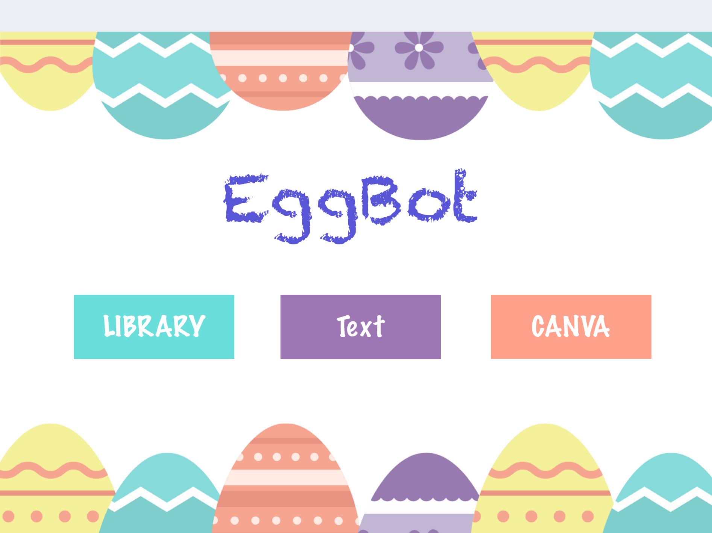
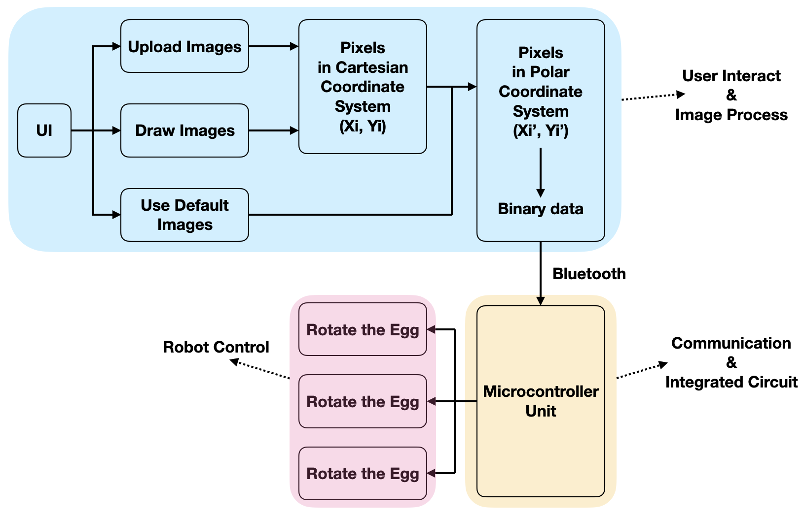
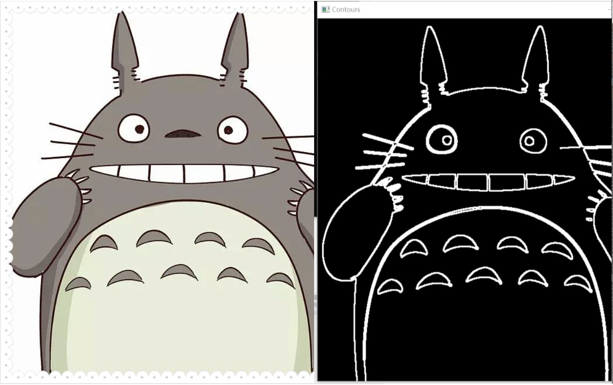

# Eggbot

Co-worker: Zhiling Zhang(张志凌), Zijie Zhou(周子杰), and Siyuan Liu(刘思源)

## 1. Overview
<video width="720" height="400" controls>
  <source src="./Eggbot.mp4" type="video/mp4">
Your browser does not support the video tag.
</video>

Our eggbot has 2 servos to control the position of eggs and the angle of the pen, a stepper motor to control the height of the pen and a microcontroller unit to manage all these motors.

To draw images on eggs, we also develop an App on iPad to allow users either draw or upload images.

The whole structure is shown in the following image, basically 3 parts:

- User Interaction Application
- Embedded System
- Mechanical Structure

## 2. Image Processing

The image that is not drawn directly on the iPad must be pre-processed to extract edges of the main object on it. We simply first apply Canny operator to detect and extract the edges, like this

However, our eggbot doesn't draw images like printers -- pixel by pixel. Instead, the eggbot draws a continuous curve on an egg, just like human! To this end, we should decompose the black-white image into many different continues curves and save these points. For each curve, we only need save the start point and the offsets.

## 3. PCB Design

The embedded system is based on STM32F105. The system has 3 parts:

- Microcontroller
- Stepper Driver
- Power Management

Details can be found in the following circuit diagram.

 

Moters need 12V power while microcontroller only needs 5V, so we add the power management unit.

## 4. Application Development

The iPad application is written by Swift linked with OpenCV, a C++ library.

3 functions was embedded in this application, namely

- User Interation
- Image Processing
- Data Comunication

The User Interation allows users to either draw images on the iPad or upload images from photo library. The image processing was introduced in the [2. Image Processing](#2. image-processing).

This application is available now. Click [GitHub repo](https://github.com/yxli2123/PROJ_eggbotApp)

