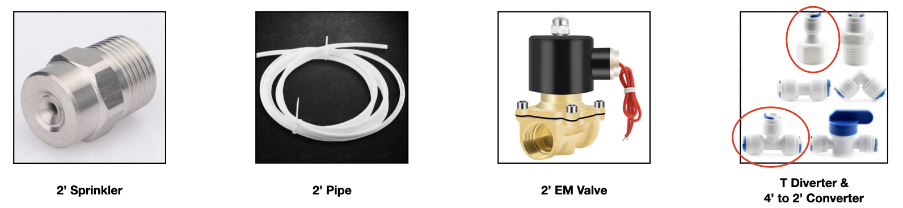

# RemoteSprinkler-Homekit

Remotely control sprinklers to water plants on the balcony through Apple HomeKit

## Overview

The following illustration demostrates the overview of the remote sprinkler control system. The system mainly consists of 2 parts: 
-  The stem: sprinklers, water pipes, solenoid valves, T-shape diverters, and a 4' to 2' convertor.
-  The controller: a 4-channel relay and a ESP8266 chip. They are ensembled on a single board.

Notice: The input voltage of solenoid valve is 12V while the board is 5V, so a 12V to 5V convertor is needed in this system. You may find a 5V solenoid valve to avoid the voltage convertor.

## Stem

The size of my tap is 4'. However, I choose 2' pipes and converters to balance the water pressure and save money.(4' solenoid valves are more expensive)

## Controller

The relay works like a switch. The main difference here is that switches change ON/OFF status by physical touch while relays rely on electronic signal sent by a controller (ESP8266 in this system).

Here's the way to connect solenoid valves to the controller board:
-  Twist the 4 black negative cables of the solenoid valves together. This twisted line will connect to the negtive pin of the 12V battery directly.
-  Connect each of the red positive cable to the 4 difference NC (normally closed) nodes on the relay.
-  Connect the positive pin of the 12 battery to the 4 different COM nodes on the relay. 

Now here's how the magic happens, the control code.

### Basic code for ESP8266

In electronic, we usually use high and low voltage to control a binary status. Here we use high voltage to represent ON, which means the relay will connect COM to NC, and vice versa.

To write the HIGH/LOW to target pins in ESP8266, 2 steps are need. For example, if we would like to change the voltage of GPIO4 on the ESP8266, we 
- First set the mode of pin 4 as output `pinMode(4, OUTPUT);`
- Second write the HIGH voltage to this pin `digitalWrite(4, HIGH);`

To see the complete code, download [here](uploads/remote_sprinkler.zip).

### Apple HomeKit

The previous section showed how to write the pin locally. This section demonstrate the code that can control the pin remotely through Apple HomeKit.

Arduino IDE is recomended for ESP8266 development. You can follow this [blog](https://joshspicer.com/homekit-esp8266) to setup the Apple HomeKit development environment. 

Thanks to Mixiaoxiao's project [Arduino-HomeKit-ESP8266](https://github.com/Mixiaoxiao/Arduino-HomeKit-ESP8266), we can modify one of the example to achieve the system.

