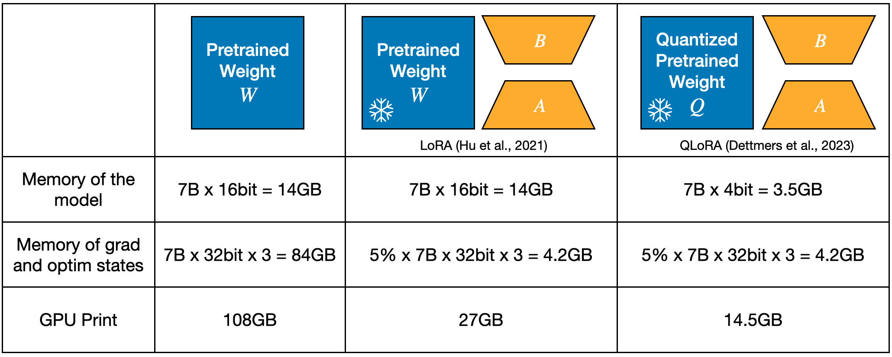

Fine-tuning a large language model (LLM) in your personal computer is not a dream. Even though we are so used to the LLM services that are deployed in the cloud, like chat-GPT or Claude, we still hope to finetune an LLM on our personal and private data. For example, design personalized travel itineraries, optimize our small business operations, etc. Yet, this power has traditionally been locked away, accessible only to those with rich computing resources, but today, I am telling you, you can train an LLM with 7 billion parameters within 16GB GPU memory (RTX 4080 for example)! Let’s see how it works.

To cram an LLM into a small GPU and finetune it, researchers utilize two techniques: **LoRA finetuning** and **quantization**. [LoRA](https://arxiv.org/abs/2106.09685) finetuning adds low-rank adapters to the pretrained weights that are frozen during finetuing. Since it only trains the adapter parameters, which are often less than 5% of the pretrained weights, it saves massive training memory, such as gradients and optimization states of trainable parameters. As the pretrained weight itself is still huge, researchers quantize the pretrained weight from 16 bits to 4 bits, which saves 75% of memory. 

The comparisons are shown in Figure 1. Combining these two techniques ([QLoRA](https://arxiv.org/abs/2305.14314)), one can finally finetune their LLMs on one single GPU. However, everything comes with price: <u>quantization brings discrepancy and the discrepancy will lower the finetuning performance</u>.



​                                                      Figure 1. GPU memory comparison of different fine-tuning methods.

## LoftQ: bridge the quantization gap

Our approach, [LoftQ: LoRA-fine-tuning-aware Quantization](https://arxiv.org/abs/2310.08659), aims to bridge the quantization error gap. With the same architecture as QLoRA: a quantized backbone and LoRA adapters, our method takes the subsequent LoRA finetuning into consideration when applying quantization. Specifically, we minimize the following objective to obtain a good initialization for LoRA fine-tuning:
$$
\underset{Q, A, B}{\mathrm{min}} ||W - Q - AB^{\top}||_\mathrm{F}^2
$$
Intuitively, our method redistributes the knowledge in the pretrained weight to both the quantized weight and the low-rank adapter. In contrast to QLoRA, only the quantized backbone contains the pretraining knowledge, some of which is even lost during quantization. Technically, our method provides a closer initialization (the sum of the quantized backbone and low-rank adapters) to the pretrained weight than QLoRA, which makes the training start from a more appropriate point.

We solve the optimization problem by applying quantization and low-rank approximation in an alternating way. We fix the low-rank adapter $A,B$ and obtain $Q$ by quantizing $W-AB^{\top}$. We then fix $Q$ and obtain $A, B$ by low-rank approximation of $W-Q$​ using SVD. We repeat these two processes until the objective is minimized (usually less than 5 rounds). 

Advantages of the alternating algorithm:

- It does not involve any calibration data, compared to some post-training methods.
- It can be applied to each weight matrix in parallel, which saves a lot of time. 
- Once the optimal $Q, A, B$ are obtained, one can reuse it for many different downstream tasks. Fortunately, we have provided the initialization of some popular models for you. Check it out on our [Huggingface model repository](https://huggingface.co/LoftQ)

## How well does LoftQ work?

We have tested our method in different mainstream architecture of models: encoder-only (e.g., DeBERTa), encoder-decoder (e.g., bart-large), and encoder-only (e.g., LLAMA, Mistral, Phi-2). 

- We observe our method is consistently better than QLoRA. 
- In extreme low-bit cases, 2-bit quantization for example, LoftQ converges to a reasonable performance, while QLoRA sometimes does not converge.
- We also find that the training loss of LoftQ decays faster than QLoRA, so we can use less training iterations and save energy. Take finetuning Phi-2 on GSM8K as an example, LoftQ needs 6 epochs while QLoRA needs 8 epochs.


​					Figure 2. Results of fine-tuning DeBERTa-base on GLUE and ANLI dataset.


​							Figure 3. Results of finetuning BART-large on summarization tasks.

### Phi-2 on GSM8K

| Model | Bits | Rank | LoRA Initial           | GSM8K    |
| ----- | ---- | ---- | ---------------------- | -------- |
| Phi-2 | 16   | -    | Full model fine-tuning | 66.8±1.2 |
| Phi-2 | 16   | 64   | Gaussian + 0           | 64.8±0.5 |
| Phi-2 | 4    | 64   | Gaussian + 0 (QLoRA)   | 60.2±0.6 |
| Phi-2 | 4    | 64   | LoftQ                  | 64.1±0.7 |

​						Figure 4. Results of finetuning LLAMA models on WikiText and GSM8K datasets.

## How to use LoftQ?

### Use cases

- Using LoftQ for finetuning Phi-2 model (around 3 billion parameters) on consumer hardware with 11GB of RAM, such as Nvidia GeForce RTX 2080 Ti, Nvidia GeForce RTX 3080, etc. 
- Using LoftQ for finetuning Mistral-7B model (around 7 billion parameters) on consumer hardware with 16GB of RAM, such as Nvidia GeForce RTX 4080. You can also use [Deepspeed Zero 3](https://www.deepspeed.ai/2021/03/07/zero3-offload.html) to cram it into one 11GB GPU.

### Example

Let’s take finetuning Phi-2 as an example.

1. Let's get the necessary imports

   ```python
   import torch
   from transformers import AutoModelForCausalLM
   from peft import PeftModel
   from BitsAndBytesConfig  # new
   ```

2. Load the quantized backbone $Q$ obtained by LoftQ.

   ```python
   # fetch the MODEL_ID at https://huggingface.co/LoftQ
   MODEL_ID = "LoftQ/phi-2-4bit-64rank"
   quant_config = BitsAndBytesConfig(load_in_4bit=True, bnb_4bit_quant_type='nf4')  # new
   base_model = AutoModelForCausalLM.from_pretrained(
       MODEL_ID, 
       quantization_config=quant_config,  # new
   )
   ```

3. Load the low-rank adapter $A, B$ obtained by LoftQ.

   ```python
   peft_model = PeftModel.from_pretrained(
       base_model,
       MODEL_ID,
       subfolder="loftq_init",  # choose the LoftQ adapter
       is_trainable=True,
   )
   ```

That's it! The rest of the training loop remains the same. Please refer to the [train_gsm8k.py](https://github.com/yxli2123/LoftQ/blob/main/train_gsm8k.py) for an end-to-end example.

We have provided the initialization of several popular models, such as BART-large, LLAMA-2 series, Mistral-7B, Phi-2. Check it out on our [Huggingface model repository](https://huggingface.co/LoftQ). 

## Acknowledgements

We would like to thank Yifan Yu for conducting the exploration of LoftQ on encoder-only models. We would like to thank Chen Liang, Pengcheng He, Nikos Karampatziakis, Weizhu Chen, Tuo Zhao for their research collaboration.
